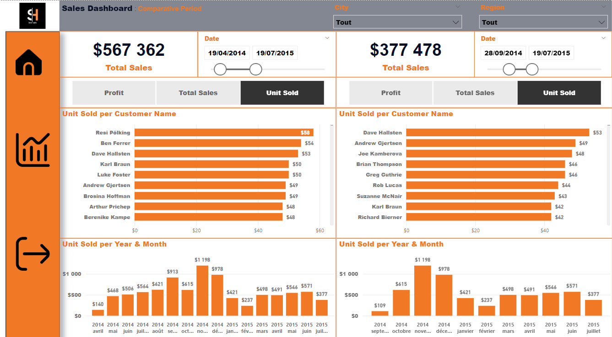
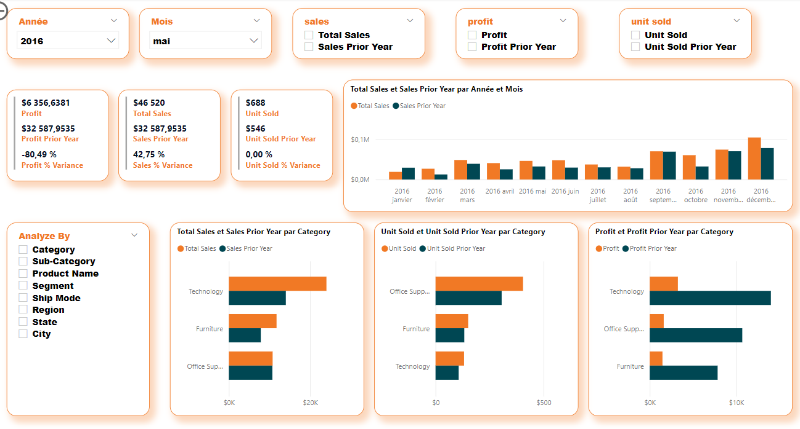
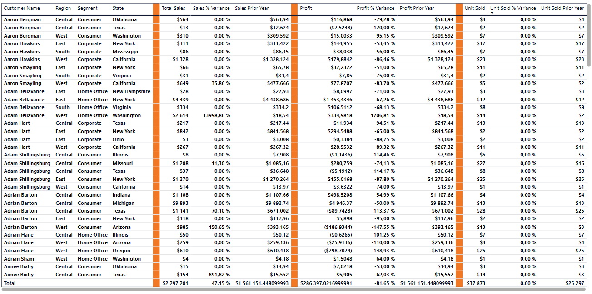

# Sales and Profit KPI Analysis Dashboard

## Overview

The **Sales and Profit KPI Analysis Dashboard** provides an interactive, data-driven overview of your sales and profit metrics. Designed for management controllers, this dashboard empowers you with actionable insights to enhance business strategy and optimize performance.

## Key Features

- **Comparative Analysis**: Compare KPIs across different periods to identify trends, patterns, and outliers.
- **Granular Insights**: Drill down by customer, region, product category, and more to pinpoint strengths and areas for improvement.
- **Interactive Visualizations**: Engage with dynamic charts and graphs to uncover deeper insights.
- **Filtering and Segmentation**: Focus on specific segments or time periods using various filters.
- **Customizable Date Ranges**: Analyze performance within specific time frames with custom date filters.

## How to Use

### Page 1: Dashboard Overview
- **Select Date Range**: Use date filters to set your desired analysis period.
- **Explore Key Metrics**: Review metrics for overall sales, profit, and units sold.
- **Drill Down into Details**: Click chart segments for more granular data.

### Page 2: Filtering and Interaction
- **Apply Filters**: Narrow down data to specific segments.
- **Analyze Trends**: Study line charts for trends over time.
- **Compare Performance**: Use bar charts to compare categories.

### Page 3: Detailed Customer-Level Analysis
- **Identify Top and Bottom Performers**: Sort by sales, profit, or units sold to see the best and worst performers.
- **Analyze Variance**: Compare current-year performance to the prior year.
- **Drill Down into Details**: Click on a customer to view detailed performance metrics.

## Getting Started

1. **Access the Dashboard**: Follow the provided instructions to open the dashboard.
2. **Explore the Interface**: Familiarize yourself with the layout and navigation.
3. **Experiment with Filters and Visualizations**: Adjust filters and visuals to find key insights.
4. **Export Data**: Export data as CSV or other formats for further analysis.

## Additional Tips

- **Leverage Interactive Features**: Use hover effects and drill-down options to uncover deeper insights.
- **Customize the Dashboard**: Adjust settings to meet your needs.
- **Share Insights**: Present findings to stakeholders for data-driven decision-making.
